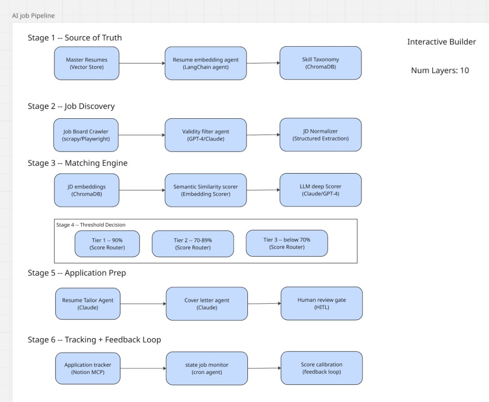

# Job Application Pipeline

A **plug-and-play AI system** for turning a **master resume** and incoming job descriptions into ranked matches, tailored application materials, and tracked outcomes. The design uses **ten configurable layers** (each slot can swap implementations) to implement a **six-stage pipeline** from source-of-truth resume data through discovery, matching, prep, and feedback.

**Interactive builder context:** The UI concept tracks **layers configured** (10/10), **estimated cost per run**, and **presets** such as Lean (local), Full cloud, Hybrid, plus **Export config**. The same skeleton supports very different cost and ops profiles by changing adapters—not by rewriting core logic.

---

## Goals

- **Single source of truth** for your resume and skills, embedded once and reused for every job.
- **Repeatable job intake** from boards, feeds, APIs, or manual paste—without locking you into one vendor.
- **Explainable matching** that combines fast retrieval, structured constraints, and optional LLM critique.
- **Tiered automation** so high-confidence matches can move faster while risky cases get review.
- **Human-in-the-loop (HITL)** before anything irreversible (for example sending or submitting an application).
- **Feedback loop** so outcomes (interview, rejection, ghosting) improve policies and evaluation over time.

**Non-goals for an MVP:** fully autonomous application submission without explicit policy; scraping every job board without a compliance strategy. See [`planning/research/PITFALLS.md`](planning/research/PITFALLS.md) for discovery and PII risks.

---

## Six-stage pipeline (what happens end to end)

These stages map directly to the diagram in `docs/ai-job-pipeline.png`.

### Stage 1 — Source of truth

- **Master resumes (vector store):** Your canonical resume text or documents are the system of record.
- **Resume embedding agent (LangChain agent):** Chunks and embeds resume content for retrieval and similarity.
- **Skill taxonomy (ChromaDB):** Structured or derived skill labels plus vectors support matching and reporting.

### Stage 2 — Job discovery

- **Job board crawler (Scrapy / Playwright):** Collects listings from the web when you are allowed to do so and when it is worth the ops cost.
- **Validity filter agent (GPT-4 / Claude):** Drops spam, mismatched roles, or low-quality postings before you spend retrieval and scoring budget.
- **JD normalizer (structured extraction):** Turns messy HTML into a **canonical job description record** (title, location, requirements, compensation if present).

### Stage 3 — Matching engine

- **JD embeddings (ChromaDB):** Embeds normalized JD text for comparison with resume evidence.
- **Semantic similarity scorer (embedding scorer):** Fast, cheap alignment between resume chunks and JD.
- **LLM deep scorer (Claude / GPT-4):** Slower, richer assessment—best when constrained by retrieved evidence and structured must-haves.

### Stage 4 — Threshold decision (score router)

Routes each job into tiers for automation and review policy:

| Tier | Score band | Typical use |
|------|------------|-------------|
| **Tier 1** | **≥ 90%** | High confidence; may allow more automation **if** Control policy allows it. |
| **Tier 2** | **70–89%** | Worth review; often generate drafts but require explicit approval. |
| **Tier 3** | **&lt; 70%** | Usually discard or deprioritize; optional manual override. |

Treat percentages as **calibrated policy outputs**, not universal truths. Tune them using labeled outcomes and held-out eval sets (see **Learning** and [`planning/research/`](planning/research/)).

### Stage 5 — Application prep

- **Resume tailor agent (Claude):** Adjusts wording and emphasis for the specific JD while preserving factual accuracy.
- **Cover letter agent (Claude):** Drafts a letter grounded in your master resume and the normalized JD.
- **Human review gate (HITL):** You approve, edit, or reject before anything is sent or logged as submitted.

### Stage 6 — Tracking and feedback loop

- **Application tracker (Notion MCP):** Records what you applied to, stage, and notes (MCP fits agent-heavy workflows; production services often use the Notion REST API with scoped tokens).
- **Status job monitor (cron agent):** Periodic checks for status changes where you have a legitimate data source.
- **Score calibration (feedback loop):** Feeds interview or rejection signals back into thresholds, weights, and eval suites so Stages 3–4 improve over time.

---

## Ten layers (plugin slots)

Each layer is a **plugin slot**: one selected implementation at runtime, swappable without rewriting the whole pipeline. Below, **Default** matches the choices shown in the interactive builder screenshots. Under each heading, **every option from the UI** is listed with what it does and when to pick it.

---

### Ingestion

**Role:** Bring raw job (and sometimes resume) content into the system—**data harvesting**.

**Default:** **Playwright (headless)**

| Option | What it does | When to choose | Trade-offs |
|--------|----------------|----------------|------------|
| **Scrapy (Python)** | Classic crawl-and-extract framework; great for many listing pages with stable HTML. | High volume, mostly static HTML, you own spider maintenance. | Fast batch throughput; weak for heavy client-side rendering unless paired with Playwright. |
| **Playwright (headless)** | Drives a real browser; executes JavaScript and fills forms when needed. | SPAs, infinite scroll, or sites that only render listings in the browser. | Higher CPU and memory; slower than pure HTTP; more brittle to UI changes. |
| **RSS / Atom feed** | Polls feeds for new entries. | Employers or boards expose feeds; lowest fuss ingestion. | Limited coverage; not all sources have feeds. |
| **Kafka consumer** | Subscribes to a stream of job events. | Enterprise pipelines already publish jobs to Kafka. | Requires streaming infra and ops expertise. |
| **S3 event trigger** | Runs ingestion when new files land in a bucket. | Batch dumps (for example daily exports) into S3. | Needs object storage and event wiring; not for live crawling alone. |
| **Custom HTTP poller** | Periodic GET/POST to an API you control or license. | Partner API with a simple contract. | You implement auth, pagination, and backoff yourself. |

**Guidance:** Prefer **APIs, feeds, and manual paste** until matching and HITL are trustworthy; add Scrapy or Playwright when you have a clear policy for each target site.

---

### Transform

**Role:** **Parse and normalize** HTML, PDFs, or API payloads into a consistent schema for embedding and matching.

**Default:** **Unstructured.io**

| Option | What it does | When to choose | Trade-offs |
|--------|----------------|----------------|------------|
| **BeautifulSoup + regex** | Lightweight HTML parsing and pattern extraction. | Simple pages; you want minimal dependencies. | Breaks on messy markup; poor for PDFs and complex layouts. |
| **Unstructured.io** | Library and pipelines for partitioning and structuring many document types. | Mixed formats (HTML, PDF, DOCX) in one stack. | Heavier dependency; tune for your doc mix. |
| **Docling (local)** | Local document conversion and parsing workflows. | Offline or privacy-sensitive parsing; IBM-style doc stacks. | Ops cost of local models; integration work. |
| **Apache Tika** | Content detection and text extraction (Java ecosystem). | You already run JVM services or need broad format support. | Extra service to deploy and monitor. |
| **Custom ETL script** | Your own parsers and transforms. | Oddball sources with stable quirks you can codify. | Maintenance burden stays on you. |

---

### Storage

**Role:** **Embed and persist** vectors and metadata for resumes and jobs.

**Default:** **ChromaDB (local)**

| Option | What it does | When to choose | Trade-offs |
|--------|----------------|----------------|------------|
| **ChromaDB (local)** | Embedded or local vector database; quick to start. | Development, single-user, or first MVP. | Not always what you want for multi-tenant production at large scale. |
| **Pinecone** | Managed vector database in the cloud. | Managed ops, elastic scale, low admin. | Ongoing cost; network latency; account design for isolation. |
| **Weaviate** | Open vector search with GraphQL and modules. | You want hybrid search features and an open-core model. | Self-host ops or managed vendor choices to evaluate. |
| **Qdrant** | Vector DB with strong filtering and hybrid search patterns. | Dense metadata filters (location, seniority) with vectors. | Self-host or cloud; learn operational model. |
| **pgvector** | PostgreSQL extension for vector similarity. | You want relational data and vectors in one ACID database. | Requires Postgres tuning and migration discipline. |
| **Milvus** | Open-source vector DB aimed at scale-out AI search. | Large corpora and high QPS search. | Heavier cluster footprint than SQLite or Chroma. |

**Guidance:** Keep a **narrow storage interface** in code so you can start on Chroma and move to pgvector or Qdrant when hybrid search or transactions demand it.

---

### Retrieval

**Role:** Fetch the best resume **evidence** for a job and support ranking—**semantic search** plus optional keyword signal.

**Default:** **BM25 hybrid**

| Option | What it does | When to choose | Trade-offs |
|--------|----------------|----------------|------------|
| **BM25 hybrid** | Combines sparse keyword (BM25) and dense vector retrieval, then fused or reranked. | Job titles and acronyms matter as much as paraphrase; industry standard for RAG quality. | More moving parts than pure vectors; needs tuning and eval. |

If your builder also lists pure dense or pure sparse modes, treat **hybrid** as the default for job text where **exact tokens** (for example “Kubernetes”, “SOC 2”) matter.

---

### Orchestration

**Role:** **Agent loop control**—state, branching, retries, and human interrupts.

**Default:** **LangGraph stateful**

| Option | What it does | When to choose | Trade-offs |
|--------|----------------|----------------|------------|
| **LangGraph stateful** | Graph-based state machine with persistence and interrupts for HITL. | Long-running flows, cycles, feedback loops, production agents. | Learning curve versus linear chains. |
| **LangChain ReAct** | Tool-calling agent loop in a single session. | Quick prototypes with tools. | Harder to enforce long-run durability and auditability than a compiled graph. |
| **CrewAI multi-agent** | Role-based multi-agent collaboration. | Clear division of labor (researcher vs writer). | Coordination overhead; more prompts to maintain. |
| **Temporal workflow** | Durable workflow engine for retries and timers. | Large orgs with Temporal already; long-running human waits. | Heavy infra; strongest when you already run Temporal. |
| **AutoGen** | Multi-agent conversation frameworks. | Experimental multi-agent setups. | Less opinionated production path than LangGraph for single-owner pipelines. |
| **Custom loop** | Your own while-loop and state object. | Full control or minimal dependencies. | You reimplement checkpoints, retries, and HITL safety. |

---

### Intelligence

**Role:** **LLM reasoning**—normalize text, filter junk, score matches, draft materials.

**Default:** **Claude Sonnet 4.5**

| Option | What it does | When to choose | Trade-offs |
|--------|----------------|----------------|------------|
| **Claude Sonnet 4.5** | Strong general reasoning and writing; good for long JDs and careful edits. | High-quality drafts and nuanced scoring when budget allows. | Higher cost than small models; API policy and rate limits. |
| **GPT-4o** | OpenAI multimodal family; fast iteration and broad tool ecosystem. | You standardize on OpenAI stack or need vision later. | Cost and vendor lock-in tradeoffs like any cloud LLM. |
| **Gemini 1.5 Pro** | Long context and Google ecosystem integration. | You already run on GCP or need huge context windows. | Evaluate data handling and regional availability for your account. |
| **Ollama (local)** | Run open models locally via Ollama. | Privacy, offline dev, or cost control for experiments. | Weaker or smaller models; hardware limits throughput. |
| **Mixtral 8x7B** | Open-weights MoE model; often run via local or hosted inference. | Balance of quality and cost when self-hosting. | Hosting and quantization expertise required. |
| **Command R+** | Cohere-style models focused on RAG-style tasks. | Enterprise Cohere deployments or retrieval-heavy workloads. | Vendor-specific APIs and pricing. |

**Guidance:** Pin **model IDs and versions** in configuration so tiers and eval baselines do not drift silently.

---

### Control

**Role:** **HITL and guardrails**—who must approve what before side effects.

**Default:** **Confidence threshold**

| Option | What it does | When to choose | Trade-offs |
|--------|----------------|----------------|------------|
| **Skip (auto-approve)** | No human gate for that step. | Trusted internal pipelines only; never for first production contact with employers. | Highest risk of bad sends or misrepresentation. |
| **Slack approval gate** | Sends a card or message to approve or deny. | Teams already live in Slack; fast mobile review. | Requires Slack app setup and alert hygiene. |
| **Email digest + confirm** | Batches actions into an email you confirm. | Low-volume, asynchronous review. | Slower feedback; easy to miss deadlines. |
| **LangSmith eval filter** | Uses evaluation metrics or rules from LangSmith to block bad outputs. | You already centralize traces and evals in LangSmith. | Requires eval suite quality; vendor coupling. |
| **Confidence threshold** | Proceeds only if model or composite score clears a bar. | Cheap first-pass automation with measurable scores. | Scores can be miscalibrated; combine with structured checks. |
| **Human review UI** | Dedicated UI for review and edits. | Highest control; complex workflows and audit trails. | Build and maintain a frontend. |

**Guidance:** Combine **Confidence threshold** with **Human review UI** or **Slack** for anything that affects your reputation.

---

### Output

**Role:** **Write results**—persist artifacts and notifications.

**Default:** **Notion MCP**

| Option | What it does | When to choose | Trade-offs |
|--------|----------------|----------------|------------|
| **Notion MCP** | Writes pages or database rows via Model Context Protocol. | Agent-driven dev workflows and rapid prototyping. | MCP is for tooling; long-running jobs should prefer the official API with scoped tokens. |
| **Google Drive MCP** | Stores generated files in Drive. | Teams standardized on Google Workspace. | Permissions and shared drive complexity. |
| **Slack message** | Posts summaries or alerts to a channel. | Lightweight visibility without a full CRM. | Not a structured database by itself. |
| **PostgreSQL insert** | Writes structured rows you own. | You need SQL queries, joins, and strong consistency. | You operate schema migrations and backups. |
| **Webhook POST** | Sends JSON to your endpoint. | Integrate with Zapier, internal services, or custom UIs. | You must handle auth, retries, and idempotency. |
| **S3 / file write** | Writes artifacts to object storage. | Audit trail, cheap storage, or downstream batch processing. | Not a human-friendly tracker without a viewer. |

---

### Scheduling

**Role:** **Trigger cadence**—when to poll, crawl, re-embed, or check status.

**Default:** **APScheduler (Python)**

| Option | What it does | When to choose | Trade-offs |
|--------|----------------|----------------|------------|
| **Cron (system)** | OS crontab invokes your script. | Single server, simple schedules. | Less visibility than a workflow engine; machine-bound. |
| **APScheduler (Python)** | In-process scheduler for Python jobs. | Single-process app with periodic tasks. | Dies with the process; not distributed by itself. |
| **Temporal cron** | Schedules durable workflows. | You already use Temporal for reliability. | Heavier stack than cron for small projects. |
| **GitHub Actions** | CI cron on hosted runners. | Public or private repos; scheduled maintenance tasks. | Not ideal for secret-heavy scraping at high frequency. |
| **Airflow DAG** | Dataflow orchestration with dependencies. | Data engineering team and complex DAGs. | Heavy for a personal pipeline unless you already run Airflow. |
| **Manual / on-demand** | No schedule; user or API triggers runs. | Early development or expensive operations. | No automation until you add one. |

---

### Learning

**Role:** **Feedback and eval**—measure quality and feed calibration.

**Default:** **Ragas eval**

| Option | What it does | When to choose | Trade-offs |
|--------|----------------|----------------|------------|
| **LangSmith tracing** | Traces runs, datasets, and experiments. | Debug LangChain and LangGraph apps; collaborate on prompts. | SaaS cost; vendor coupling. |
| **Weights & Biases** | Experiment tracking and model monitoring. | ML-heavy teams already on W&B. | Overkill if you only need RAG metrics. |
| **Helicone** | LLM observability gateway and analytics. | Centralized logging across providers. | Another service to fund and configure. |
| **Ragas eval** | Metrics for RAG quality (faithfulness, context precision, and related measures). | You change chunking, retrievers, or prompts and need regression signal. | Needs labeled or synthetic eval sets; metrics are not business outcomes alone. |
| **Custom score logger** | Your own tables of scores, labels, and outcomes. | Full control; tie to interview outcomes in your CRM. | You design the schema and dashboards. |
| **Skip** | No automated learning hooks. | First prototype wiring only. | No guardrails when you change models. |

**Guidance:** Pair **Ragas** (or similar) with **human labels** and **real outcomes**—interview invites and rejections—so you do not optimize only to an LLM judge.

---

## Default stack (decision-first path)

The following is a coherent **low-friction local-first** path that matches the builder screenshots:

| Layer | Default |
|-------|---------|
| Ingestion | Playwright (headless) |
| Transform | Unstructured.io |
| Storage | ChromaDB (local) |
| Retrieval | BM25 hybrid |
| Orchestration | LangGraph stateful |
| Intelligence | Claude Sonnet 4.5 |
| Control | Confidence threshold |
| Output | Notion MCP |
| Scheduling | APScheduler (Python) |
| Learning | Ragas eval |

**Estimated cost posture:** Builder-style UI often shows **low cost** for local or hybrid layers and **higher cost** for frontier LLM calls; treat estimates as **per-run approximations** that change with model choice, listing volume, and caching.

---

## Data flow (contracts between pieces)

1. **Resume** → Transform → **chunks** → Storage (embeddings + metadata) → Skill taxonomy signals.  
2. **Job** → Ingestion → Transform → **normalized JD** → Storage (JD embedding).  
3. **Retrieval** pulls top-K resume chunks for the JD → **Intelligence** scores (similarity plus optional LLM).  
4. **Control** applies tier thresholds and approval rules → **Application prep** drafts.  
5. **Output** writes tracker rows and files → **Scheduling** runs monitors → **Learning** updates eval metrics and calibration.

---

## Reliability, safety, and operations

- **Grounding:** Require retrieval **chunk IDs** or citations in LLM scoring when possible so rankings are auditable.  
- **Structured gates:** Combine embeddings with **must-have fields** (location, authorization, years of experience) parsed in Transform.  
- **HITL:** Use LangGraph **interrupts** for approvals that can take hours; persist state so restarts are safe ([LangGraph interrupts](https://docs.langchain.com/oss/python/langgraph/interrupts)).  
- **Secrets:** Keep API keys in environment variables; never commit them to `.planning/` or README examples.

---

## Testing and evaluation

- **Unit tests** for normalization and tier policy (see [`planning/codebase/TESTING.md`](planning/codebase/TESTING.md)).  
- **Ragas** (or equivalent) on a **fixed eval set** whenever retrieval or chunking changes.  
- **Calibration:** Hold out labeled jobs and compare tier decisions before changing production thresholds.

---

## Planning artifacts

| Path | Contents |
|------|----------|
| [`planning/research/`](planning/research/) | Domain research: `SUMMARY.md`, `STACK.md`, `FEATURES.md`, `ARCHITECTURE.md`, `PITFALLS.md` |
| [`planning/codebase/`](planning/codebase/) | Conceptual codebase map for this repo (pre-code) |

A copy of the same files may exist under `.planning/` for tools that expect that layout; the root `.gitignore` in `dev/` ignores `.planning/`, so **tracked** copies live under `planning/` here.

---

## Next implementation milestones

1. Python package layout, configuration, and dependency lockfile.  
2. Minimal LangGraph: ingest pasted JD → normalize → embed → retrieve → score → tier → draft (no auto-send).  
3. Notion or database Output adapter with explicit HITL.  
4. Optional Playwright ingestion behind a feature flag and site policy.  
5. Learning loop wiring labels and outcomes into threshold calibration.

For deeper rationale and risks, start with [`planning/research/SUMMARY.md`](planning/research/SUMMARY.md) and [`planning/research/PITFALLS.md`](planning/research/PITFALLS.md).
