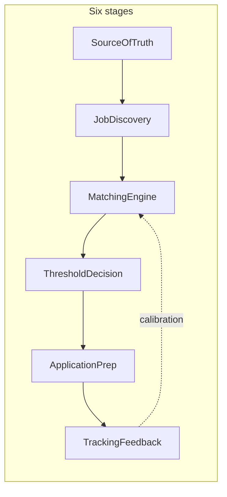

# Architecture (conceptual)

**Path:** `job-application-pipeline/`  
**Mapped:** 2026-04-14  
**Entry points:** None yet; README and `docs/ai-job-pipeline.png` describe the target system.

## High-level pattern

The system is a **pipeline of plugin slots** (ten layers) implementing a **six-stage AI job pipeline**: source of truth, job discovery, matching, threshold routing, application prep, tracking and feedback. Orchestration should be implemented as a **LangGraph** state machine with checkpoints and **interrupts** for human review before irreversible actions.

## Layered architecture

| Layer | Role in stages |
|-------|----------------|
| Ingestion | Stage 2 raw intake; also resume file intake for Stage 1 |
| Transform | Normalize JD and resume text to canonical schemas |
| Storage | Embeddings and document chunks for Stages 1 and 3 |
| Retrieval | Candidate evidence for scoring |
| Orchestration | Cross-cutting graph for Stages 3–5 and HITL |
| Intelligence | Embedding models, similarity, LLM scorers |
| Control | Tier thresholds, approval policies, guardrails |
| Output | Tracker writes, exports, notifications |
| Scheduling | Cron for monitors and batch embed jobs |
| Learning | Metrics, labels, calibration |

## Tier routing (Stage 4)

- **Tier 1:** Score at or above 90% — high confidence; may allow more automation per policy.  
- **Tier 2:** 70–89% — review-heavy or prep-only automation.  
- **Tier 3:** Below 70% — typically discard or deprioritize; optional human override.

Tiers are **policy outputs**; they should be calibrated from labeled outcomes, not fixed forever.

## Data flow (conceptual)

1. Master resume → chunks and embeddings → skill taxonomy and vector index.  
2. Jobs → normalized JD records → JD embeddings.  
3. Match → similarity plus optional LLM deep score → tier.  
4. Tier passes gate → tailored resume and cover letter → HITL → tracker.  
5. Outcomes → calibration data for thresholds and eval sets.

## Error handling (conceptual)

- Retries at orchestration layer for transient LLM and API errors.  
- Dead-letter or quarantine queue for failed ingest records.  
- Never auto-submit applications without Control layer approval when policy requires it.

## Key files (current)

- `README.md` — product and layer documentation.  
- `docs/ai-job-pipeline.png` — six-stage diagram.  
- `.planning/research/*.md` — domain research.  
- `.planning/codebase/*.md` — this map.
